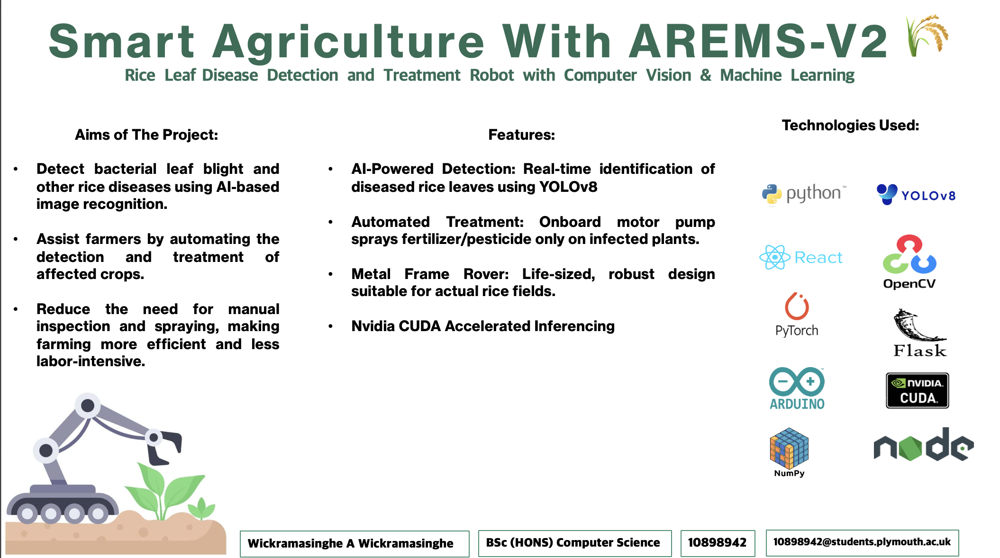
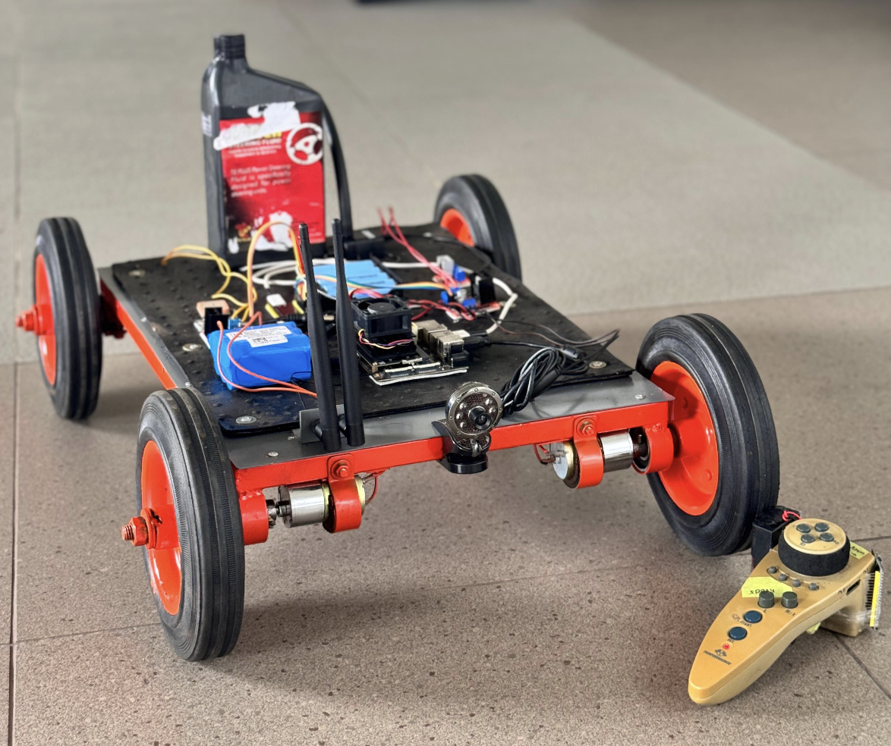
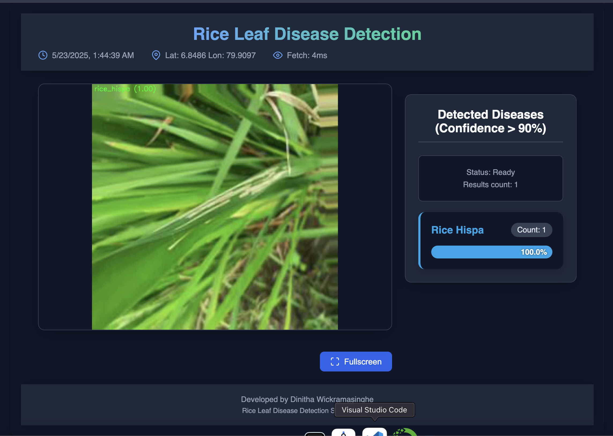

# Rice Leaf Disease Detection & Autonomous Fertilization System

<p align="center">
  
</p>

A smart agriculture solution that leverages deep learning and robotics to detect rice leaf diseases in real time and autonomously apply targeted fertilization. This project integrates computer vision, a web dashboard, and embedded systems to enhance crop health, optimize fertilizer use, and reduce manual labor.

---

## Table of Contents

- [Rice Leaf Disease Detection \& Autonomous Fertilization System](#rice-leaf-disease-detection--autonomous-fertilization-system)
  - [Table of Contents](#table-of-contents)
  - [Features](#features)
  - [Project Structure](#project-structure)
  - [System Overview](#system-overview)
  - [Dashboard Screenshot](#dashboard-screenshot)
  - [Getting Started](#getting-started)
    - [Backend Setup](#backend-setup)
    - [Frontend Setup](#frontend-setup)
    - [Model Training](#model-training)
    - [Embedded Logic](#embedded-logic)
  - [Usage](#usage)
  - [Contributing](#contributing)
  - [License](#license)

---

## Features

- **Real-time Disease Detection:** Uses YOLOv8 deep learning models to identify rice leaf diseases from live video feeds.
- **Web Dashboard:** React-based dashboard for live monitoring, disease analytics, and system control.
- **Autonomous Fertilization:** Rover logic enables precise, automated fertilizer application based on detection results.
- **Modular Architecture:** Clear separation of backend, frontend, model training, and embedded logic for easy maintenance and extension.
- **Open Source:** Designed for easy customization and community contributions.

---

## Project Structure

```
.
├── backend/           # FastAPI backend for video streaming & inference
├── frontend/          # React dashboard for live monitoring & analytics
├── model-training/    # Notebooks and scripts for YOLOv8 model training
├── receiver-logic/    # Arduino code for rover receiver
├── transmitter-logic/ # Arduino code for rover transmitter/controller
├── README.md
└── LICENSE
```

---

## System Overview

<p align="center">
  
</p>

---

## Dashboard Screenshot

<p align="center">
  
</p>

---

## Getting Started

### Backend Setup

1. Navigate to the backend directory:
    ```sh
    cd backend
    ```
2. Install dependencies:
    ```sh
    pip install -r requirements.txt
    ```
3. Start the backend server:
    ```sh
    python server.py
    ```

### Frontend Setup

1. Navigate to the frontend directory:
    ```sh
    cd frontend
    ```
2. Install dependencies:
    ```sh
    npm install
    ```
3. Start the React development server:
    ```sh
    npm start
    ```

### Model Training

- Training scripts and notebooks are in [model-training/](model-training/).
- Use `main.py` or `rice-disease-yolo.ipynb` to train or fine-tune YOLOv8 models.
- Place trained weights in the appropriate backend directory for inference.

### Embedded Logic

- Arduino code for the rover's receiver and transmitter is in [receiver-logic/](receiver-logic/) and [transmitter-logic/](transmitter-logic/).
- Upload `.ino` files to the respective Arduino boards using the Arduino IDE.

---

## Usage

1. Start the backend and frontend servers as described above.
2. Access the dashboard at [http://localhost:3000](http://localhost:3000).
3. View live video, disease detections, and statistics.
4. The rover will autonomously fertilize affected areas based on detection results.

---

## Contributing

Contributions are welcome! Please open issues or submit pull requests for improvements, new features, or bug fixes.

---

## License

This project is licensed under the [MIT License](LICENSE).

---

**Developed by Dinitha Wickramasinghe**  
Rice Leaf Disease Detection System - v1.2
